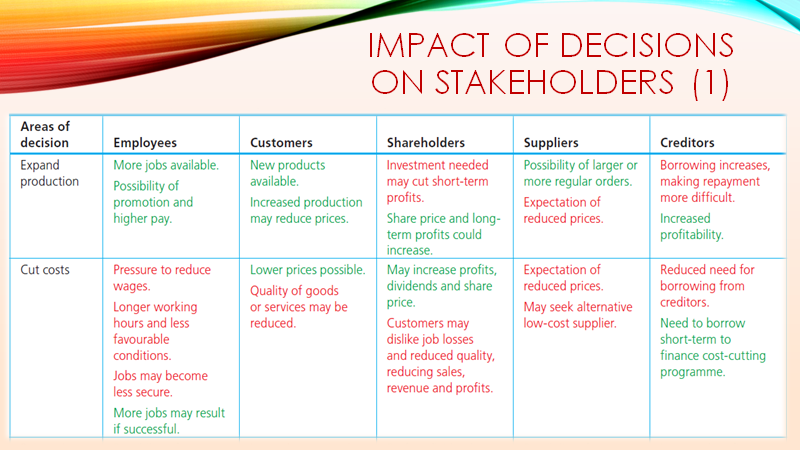
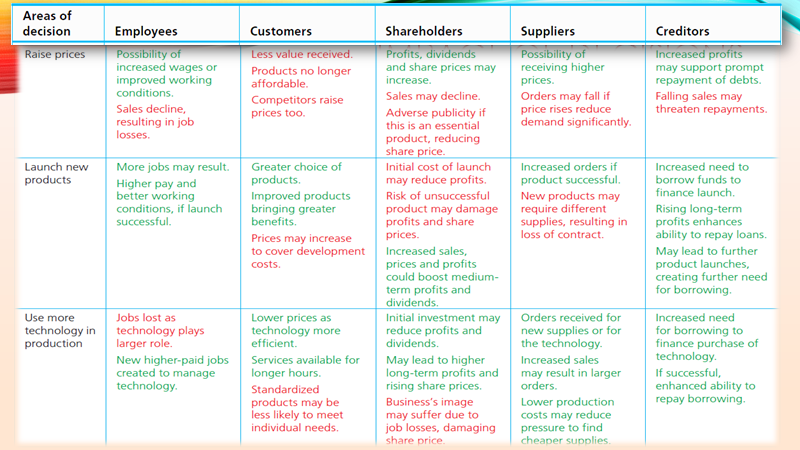
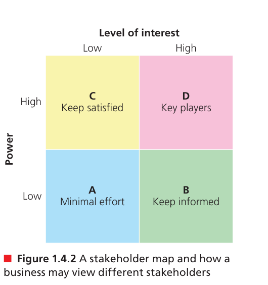

# Business 1.4.3

---
## The Stakeholder Map
The more well-organized that a stakeholder group is, the more that managers need that particular stakeholder, and the more that managers will have to agree with the stakeholder and their interests, the more likely the stakeholder is to influence a manager's decision. E.g.:
+ A workforce that is unionized may be able to negotiate for more participation in decision-making than individual employees could on their own.

+ An investor who owns 15% stake of the company selling off his/her shares may be detrimental to the business compared with one who owns only 1%.
+ A key supplier of a business's major component will have more influence over the business than a supplier of minor components.
---
## Vocabulary
+ Components
+ Utmost best
